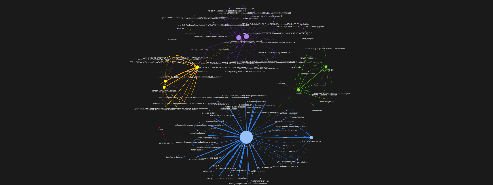

# Formulating a Knowledge Network from Malware Analysis Reports

*Illustration of a knowledge network constructed from malware reports*
Explore the interactive network here: https://rau.richards.ai/mwkg/mw_reports_test_index.html

To see a much larger graph for vidar ransomware that includes information collected from 27 unique documents check out  (prepare to wait 10+ min for graph to compose):

https://rau.richards.ai/mwkg/https://rau.richards.ai/mwkg/vidar_reports_index_yi34b.html

The same large graph created with Yi-34b as the extraction model:

https://rau.richards.ai/mwkg/https://rau.richards.ai/mwkg/idar_reports_mistral7b.html

## The Role of Knowledge Graphs in Cybersecurity Analysis
A knowledge graph in the field of cybersecurity is an intricate map of cyber threats, including malware families, threat actors, and their campaigns. It serves to elucidate the complex web of connections among various cybersecurity threats and their characteristics. Stored and managed within graph databases, these networks facilitate advanced analysis, including the discovery (prediction) of new connections.

## Generating a Knowledge Graph from Malware Reports
1. Refine the corpus of malware reports to eliminate noise.
2. Detect and categorize cybersecurity concepts, threat actors, and malware families.
3. Uncover and map the relationships between these entities.
4. Construct a graph schema to accurately model these interactions.
5. Populate the graph with nodes representing the entities and edges denoting their relationships.
6. Visualize the graph to enable analyst exploration of the data.

The visualization step, while discretionary, offers significant analytical value, presenting the data in a form that highlights relationships and patterns not immediately apparent in textual form.

## Advantages of Graphs in Malware Relationship Analysis
Employing a knowledge graph for malware analysis serves multiple strategic functions. It enables the identification of connections between malware families, drawing parallels and distinguishing traits that can be crucial for threat intelligence. Furthermore, it links threat actors to their respective malware and campaigns, offering insights into the tactics, techniques, and procedures (TTPs) employed.

Through **Graph Retrieval Augmented Generation (GRAG)**, analysts can delve deeper into the data, surpassing traditional **Retrieval Augmented Generation (RAG)** methods by utilizing the graph as a dynamic retrieval tool.

---

## Project Synopsis
This initiative focuses on the creation of a comprehensive knowledge graph from detailed malware analysis reports. This graph not only categorizes malware instances but also connects them to related threat actors and campaigns, revealing the broader narrative of cyber threats.

The process begins with the segmentation of the reports' text. Each segment undergoes a meticulous examination to extract and link cybersecurity concepts, utilizing a language model tailored for cybersecurity lexicon.

It's posited that concepts detailed in close textual proximity signify an inherent relationship. Each connection in the graph signifies a segment of text where related concepts, actors, or malware families are mentioned together.

Once the nodes (entities) and edges (relationships) are defined, the graph is assembled using dedicated libraries. The project is configured for easy local execution, removing reliance on costly cloud-based processing. Using the Mistral 7B openorca instruct model, set up through Ollama, the construction of the knowledge graph is economical.

To craft a graph tailored to malware analysis reports, adapt the following notebook:

**[extract_graph.ipynb](extract_graph.ipynb)**

The notebook executes the strategy showcased in the following flowchart.

1. Partition the text of malware reports into segments, assigning a unique ID to each.
2. In each segment, extract cybersecurity concepts, threat actors, and malware families, alongside their semantic interrelations, weighting these initial connections as W1.
3. Presume that concepts sharing a segment suggest a contextual association, with a subsequent weight of W2. It's important to note that the same pairs may be mentioned multiple times across the corpus.
4. Collate matching pairs, combine their weights, and fuse their multiple relationships into a composite, heavily weighted edge.

The notebook further computes each node's Degree and Community affiliations, which are then used to determine the visual prominence and groupings of nodes within the graph.

